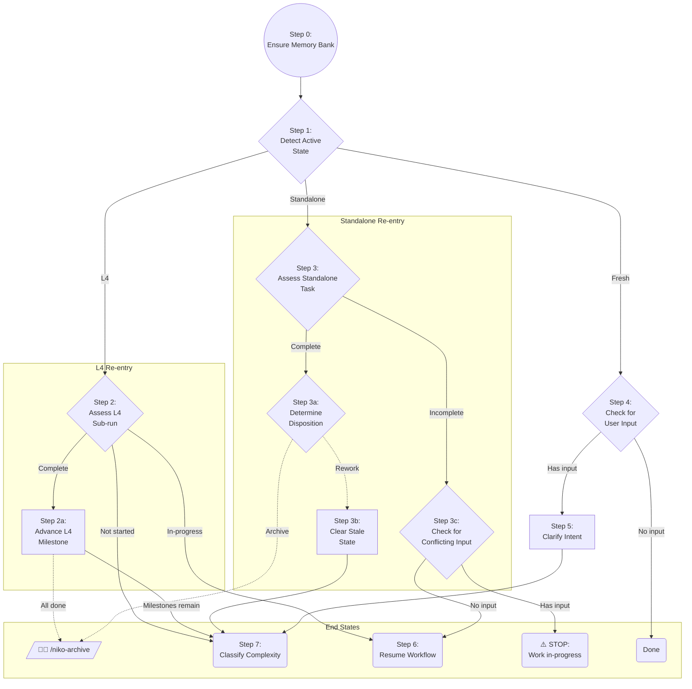

# Niko Phase - Initialization & Entry Point

`/niko` is the single entry point for the Niko system. It initializes the memory bank, detects current state, and routes to the appropriate workflow.

## Step 0: Ensure Memory Bank

Before entering the state machine, ensure the memory bank exists.

```
Load: .cursor/rules/shared/niko/core/memory-bank-paths.mdc
Load: .cursor/rules/shared/niko/core/memory-bank-init.mdc
```

If any persistent file (`productContext.md`, `systemPatterns.md`, `techContext.md`) does not exist, initialize immediately per `memory-bank-init.mdc`.

If the user's only input was to initialize the memory bank, you are done — exit and do nothing else. Otherwise, proceed to the state machine.

## State Machine



> Legend:
> - Solid edge = Transition does not require operator input
> - Dashed edge = Transition requires operator input

## How to Navigate

The flowchart above and the step definitions below form a single contract. The flowchart is the **authoritative routing map** — it shows every legal path through the state machine. The step definitions explain **how to evaluate conditions and execute procedures** at each node.

To execute `/niko`:

1. Begin at **Step 1**, whose definition is below.
2. **Decision node**: the definition describes what to evaluate and what each outcome means. Your evaluation result maps to one of the labeled edges leaving that node. Follow it to the next step.
3. **Action node**: the definition describes a procedure to execute. When complete, follow the outgoing edge to the next step.
4. Repeat from (2).
5. **Terminal nodes** (`Done`, `⚠️ STOP`, `🧑‍💻 /niko-archive`) mean stop — do not continue.

Lettered sub-steps (2a, 3a, 3b, 3c) belong to their parent step's subgraph. While inside a subgraph, your next step is either another sub-step in the same group or a top-level step — the edges make this explicit.

---

## Step 1: Detect Active State

List the files in `memory-bank/active/`. Exactly one of three states applies:

1. `milestones.md` exists → **L4** → Step 2
2. All four core ephemeral files exist (`projectbrief.md`, `activeContext.md`, `tasks.md`, `progress.md`) but no `milestones.md` → **Standalone** → Step 3
3. Neither condition is met → **Fresh** → Step 4

## Step 2: Assess L4 Sub-run

Read 

- `memory-bank/active/milestones.md`
- `memory-bank/active/activeContext.md`
- `memory-bank/active/progress.md` (if present)
- `memory-bank/active/.qa-validation-status` (if present)

Determine which state applies:

1. **Complete**: `activeContext.md` shows `REFLECT COMPLETE`, or the sub-run's complexity (from `progress.md`) is Level 1 and `.qa-validation-status` shows `PASS`. → Step 2a
2. **Not started**: `progress.md` does not exist, or the `**Complexity:**` field in `progress.md` is `Level 4` (L4 plan exists but no sub-run has been classified yet). → Step 7
3. **In-progress**: a sub-run is active but not yet complete. → Step 6

### Step 2a: Advance L4 Milestone

1. Mark the completed sub-run's milestone as `- [x]` in `milestones.md`.
2. Delete sub-run ephemeral files from `memory-bank/active/`:
    - **Delete** all of the following that exist: `tasks.md`, `activeContext.md`, `progress.md`, `creative/`, `troubleshooting/`, `.qa-validation-status`, `.preflight-status`
    - **Preserve:** `milestones.md`, `projectbrief.md`, `reflection/`
3. Re-read `milestones.md`:
    - Every milestone is `- [x]` → **All done.** Direct the operator to run `/niko-archive` for the capstone archive. STOP and wait.
    - Unchecked milestones remain → **Milestones remain** → Step 7

## Step 3: Assess Standalone Task

Read 

- `memory-bank/active/activeContext.md`
- `memory-bank/active/progress.md` (if present)
- `memory-bank/active/.qa-validation-status` (if present)

Determine which state applies:

1. **Complete**: `activeContext.md` shows `REFLECT COMPLETE`, or the task's complexity (from `progress.md`) is Level 1 and `.qa-validation-status` shows `PASS`. → Step 3a
2. **Incomplete**: task is in-progress but not yet complete. → Step 3c

### Step 3a: Determine Disposition

The previous task is complete but not yet archived. Ask the operator: **rework** or **archive**? STOP and wait for their response.

- **Archive** → direct the operator to run `/niko-archive`.
- **Rework** → gather rework context from the operator (PR feedback, reviewer comments, specific issues). → Step 3b

### Step 3b: Clear Stale State

1. Append rework initiation and the operator's feedback to `progress.md`.
2. Append a **Rework** section to `projectbrief.md` (preserve the original brief above).
3. Delete from `memory-bank/active/` all of the following that exist: `tasks.md`, `activeContext.md`, `troubleshooting/`, `.qa-validation-status`, `.preflight-status`.
4. Commit: `chore: initiating rework on [task-id]`

→ Step 7

### Step 3c: Check for Conflicting Input

A standalone task is incomplete. Evaluate whether the user provided new task input alongside the `/niko` invocation:

1. **Has input** → ⚠️ Warn the operator that work is in-progress. The current task should be archived or explicitly abandoned before starting new work. STOP and wait.
2. **No input** → Step 6

## Step 4: Check for User Input

No work is in-flight. Evaluate whether the user provided task input alongside the `/niko` invocation:

1. **Has input** → Step 5
2. **No input** → Done (nothing to do; exit)

## Step 5: Clarify Intent

```
Load: .cursor/rules/shared/niko/core/intent-clarification.mdc
```

Follow the instructions to validate the user's intent. Once the user approves the restatement, proceed to Step 7.

## Step 6: Resume Workflow

Read `progress.md` for the `**Complexity:**` field and `activeContext.md` for the `**Phase:**` field. Load the appropriate level-specific workflow and resume execution from the current phase.

- Level 1: `.cursor/rules/shared/niko/level1/level1-workflow.mdc`
- Level 2: `.cursor/rules/shared/niko/level2/level2-workflow.mdc`
- Level 3: `.cursor/rules/shared/niko/level3/level3-workflow.mdc`
- Level 4: `.cursor/rules/shared/niko/level4/level4-workflow.mdc`

## Step 7: Classify Complexity

```
Load: .cursor/rules/shared/niko/core/complexity-analysis.mdc
```

Follow the instructions to determine the complexity level. Complexity analysis will populate the memory bank's ephemeral files and guide you to the next step.
