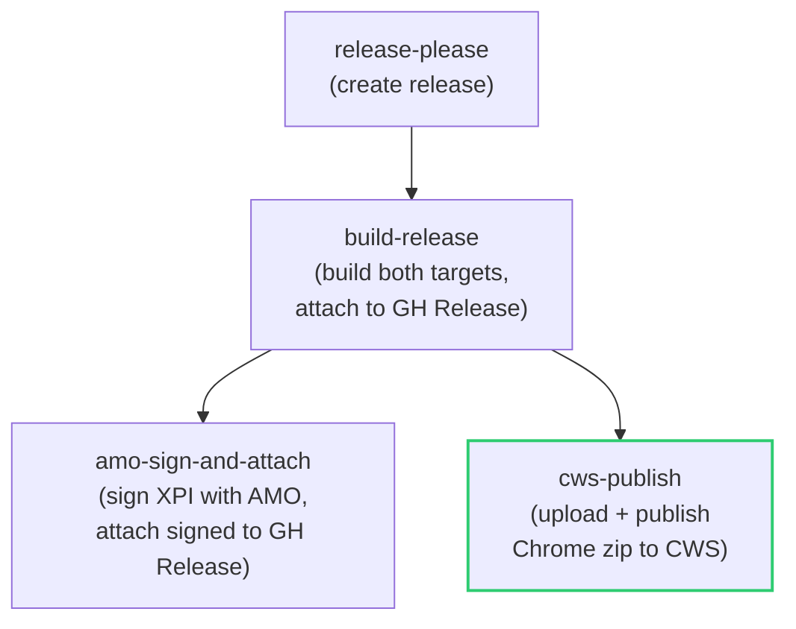

# Task: Release Pipeline — CWS Publishing, Dual-Target Release Artifacts & Account Setup Docs

* Task ID: m3-release-pipeline
* Complexity: Level 3
* Type: feature

Extend the release-please workflow to attach both Firefox XPI and Chrome zip to GitHub Releases, add a Chrome Web Store publish job, and document the one-time CWS account and OAuth2 setup.

## Pinned Info

### Release Workflow Job Dependency Graph

How the release-please.yaml jobs relate after M3 changes:

Green border = new job added by M3.

## Component Analysis

### Affected Components
- `.github/workflows/release-please.yaml`: Release workflow — rename `build-release-xpi` → `build-release`, attach Chrome zip to GH Release, stage Chrome zip as artifact for CWS, add new `cws-publish` job
- `README.md`: Releases section — update to describe dual-target release and CWS publishing, link to CWS setup guide
- `docs/cws-setup.md` (new): One-time CWS developer account, Google Cloud OAuth2 credential setup, and repo secret configuration guide

### Cross-Module Dependencies
- `cws-publish` job → `build-release` job: needs the `cws-submit` artifact (Chrome zip)
- `amo-sign-and-attach` job → `build-release` job: already depends on `amo-submit` artifact (unchanged, but `needs:` key must be updated for the job rename)
- CWS publish → repo secrets: `CWS_EXTENSION_ID`, `CWS_CLIENT_ID`, `CWS_CLIENT_SECRET`, `CWS_REFRESH_TOKEN`

### Boundary Changes
- `build-release-xpi` job renamed to `build-release` — all `needs:` references updated
- GitHub Release attachments expanded: now includes `*.xpi` **and** `*-chrome.zip`
- New repo secrets required for CWS publish (CWS job is conditional on secrets being available)
- New `docs/` directory and `docs/cws-setup.md` file

## Invariants & Constraints

- Existing Firefox/AMO pipeline must remain functional (cross-milestone invariant)
- Both builds must produce the same version number (already guaranteed — Chrome manifest derived from MV2 at build time)
- GPLv3 licensing preserved in both packages
- Zero network permissions maintained in both packages
- `release-please` continues to manage versioning; `package.json` is single source of truth
- CWS publish job must be **optional** — if CWS secrets aren't configured, the job should be skipped gracefully so the Firefox/AMO pipeline isn't blocked

## Open Questions

None — implementation approach is clear.

Key decisions made during planning:
1. **CWS publish mechanism**: Direct `curl` API calls against the Chrome Web Store API. The CWS publish flow is 3 simple REST calls (exchange refresh token → upload zip → publish). Direct curl avoids a third-party action dependency, keeps the workflow fully inspectable, and matches the project's preference for minimal tooling. (The AMO signing uses a third-party action because `web-ext sign` is a complex binary tool, not just REST calls.)
2. **CWS setup documentation location**: New `docs/cws-setup.md` file, referenced from the README Releases section. The setup procedure (developer account, Google Cloud project, OAuth2 credentials, first manual publish) is lengthy enough to warrant its own file.
3. **release-please config for dual-manifest version tracking**: Confirmed no-op. The Chrome manifest is derived at build time from the MV2 manifest, which release-please already bumps. No config change needed.
4. **CWS job conditionality**: The `cws-publish` job uses a secrets check (`if: ... && secrets.CWS_CLIENT_ID != ''`) so it's skipped when CWS isn't configured yet. This preserves the Firefox/AMO pipeline.

## Test Plan (TDD)

### Behaviors to Verify

This milestone consists entirely of CI/CD workflow YAML and documentation changes. There are no new JavaScript functions, classes, or modules — the existing build scripts (`build:ext`, `stage:chrome`, `transform-manifest`) are already tested (67 tests passing from M1/M2).

**Workflow behaviors** (verified by CI run, not unit tests):
1. `build-release` job attaches both `*.xpi` and `*-chrome.zip` to the GitHub Release
2. `build-release` job stages Chrome zip as `cws-submit` artifact
3. `cws-publish` job downloads the artifact and calls the CWS API (upload + publish)
4. `cws-publish` job is skipped gracefully when CWS secrets aren't configured
5. `amo-sign-and-attach` job still works correctly after the build job rename
6. Release-please version bumping still works correctly for both manifests

**Documentation behaviors** (verified by human review):
7. `docs/cws-setup.md` covers all bootstrapping steps: developer account, Google Cloud project, OAuth2 credentials, first manual publish, repo secrets
8. `README.md` Releases section accurately describes the dual-target release process

### Test Infrastructure

- Framework: Vitest (existing)
- Test location: `test/` directory
- Conventions: `test/<module-path>/<module>.test.js`
- New test files: **none** — no new testable JavaScript code

### Integration Tests

None — the integration test for this milestone is the release workflow itself. Verification will happen on the first real release after merge.

## Implementation Plan

### 1. Rename build job and attach Chrome zip to GH Release
- Files: `.github/workflows/release-please.yaml`
- Changes:
  - Rename `build-release-xpi` job ID to `build-release`
  - Update the `softprops/action-gh-release` step's `files:` to include both `web-ext-artifacts/*.xpi` and `web-ext-artifacts/*-chrome.zip`
  - Update `amo-sign-and-attach` job's `needs:` to reference `build-release` instead of `build-release-xpi`

### 2. Stage Chrome zip as CWS artifact
- Files: `.github/workflows/release-please.yaml`
- Changes:
  - Add `Stage CWS upload bundle` step in `build-release` job (mirrors the existing `Stage AMO signing bundle` pattern):
    - `mkdir -p cws-submit`
    - Copy `*-chrome.zip` to `cws-submit/extension.zip`
  - Add `Upload CWS bundle` step using `actions/upload-artifact@v7` with name `cws-submit`

### 3. Add CWS publish job
- Files: `.github/workflows/release-please.yaml`
- Changes:
  - Add new `cws-publish` job:
    - `needs: [release-please, build-release]`
    - `if: ${{ needs.release-please.outputs.release_created == 'true' && secrets.CWS_CLIENT_ID != '' }}`
    - Steps:
      1. Download `cws-submit` artifact
      2. Exchange refresh token for access token via Google OAuth2 token endpoint (`curl -s -X POST https://oauth2.googleapis.com/token`)
      3. Upload zip to CWS (`curl -sf -X PUT "https://www.googleapis.com/upload/chromewebstore/v1.1/items/${EXTENSION_ID}" -H "Authorization: Bearer ${TOKEN}" -T cws-submit/extension.zip`). Capture and validate response — log the response body and fail the step on non-200 status.
      4. Publish (`curl -sf -X POST "https://www.googleapis.com/chromewebstore/v1.1/items/${EXTENSION_ID}/publish" -H "Authorization: Bearer ${TOKEN}"`). Capture and validate response — same error handling pattern.
    - Secrets: `CWS_EXTENSION_ID`, `CWS_CLIENT_ID`, `CWS_CLIENT_SECRET`, `CWS_REFRESH_TOKEN`

### 4. Update README Releases section
- Files: `README.md`
- Changes:
  - Expand the Releases section to describe dual-target release:
    - Both unsigned `.xpi` and Chrome `.zip` are attached to the GitHub Release
    - The `.xpi` is submitted to AMO for signing (existing)
    - The Chrome `.zip` is uploaded to the Chrome Web Store (new)
  - Add link to `docs/cws-setup.md` for CWS account setup

### 5. Create CWS setup documentation
- Files: `docs/cws-setup.md` (new)
- Contents:
  1. **Prerequisites**: Chrome Web Store developer account ($5 one-time registration fee)
  2. **Google Cloud project setup**: Create project, enable Chrome Web Store API
  3. **OAuth2 credential generation**: Create OAuth2 client ID (Desktop app type), obtain client secret, generate refresh token using the consent flow with `https://www.googleapis.com/auth/chromewebstore` scope
  4. **First manual publish**: Upload extension manually via CWS Developer Dashboard (required before API publishing works — preflight advisory #3)
  5. **Repository secrets**: Configure `CWS_EXTENSION_ID`, `CWS_CLIENT_ID`, `CWS_CLIENT_SECRET`, `CWS_REFRESH_TOKEN` in GitHub repo settings

### 6. Verify release-please config (no-op)
- Files: `release-please-config.json` (read-only verification)
- Changes: None. The Chrome manifest is derived at build time from `manifest.json`, which release-please already bumps via `extra-files: ["manifest.json"]`. Confirmed no config change needed.

## Technology Validation

No new technology — validation not required. The CWS API is used via `curl` (already available in the runner). No new npm dependencies. No new GitHub Actions beyond the standard `actions/download-artifact` which is already in use.

## Challenges & Mitigations

- **CWS API may reject the upload**: If the extension version already exists on CWS, the upload will fail. Mitigation: This shouldn't happen because release-please bumps the version before the release is created. Document this constraint in `docs/cws-setup.md`.
- **CWS review delays**: CWS may queue the extension for manual review (hours to days). The workflow job succeeds as long as the upload and publish API calls return 200. Mitigation: Document that CWS review is asynchronous; the published version may not appear immediately.
- **First publish must be manual**: CWS API requires the extension to exist (have been published at least once) before API uploads work (preflight advisory #3). Mitigation: Documented in `docs/cws-setup.md` as a required bootstrapping step.
- **Secrets not configured**: If CWS secrets aren't set up, the job must not block the release. Mitigation: `cws-publish` job uses `if:` condition checking for secret availability. The Firefox/AMO pipeline continues independently.
- **Job rename breaks `needs:` references**: Renaming `build-release-xpi` to `build-release`. Mitigation: Update all `needs:` references in the same commit (only `amo-sign-and-attach` references it).

## Status

- [x] Component analysis complete
- [x] Open questions resolved
- [x] Test planning complete (TDD)
- [x] Implementation plan complete
- [x] Technology validation complete
- [x] Preflight (PASS — 2 advisory items, no blockers)
- [ ] Build
- [ ] QA
