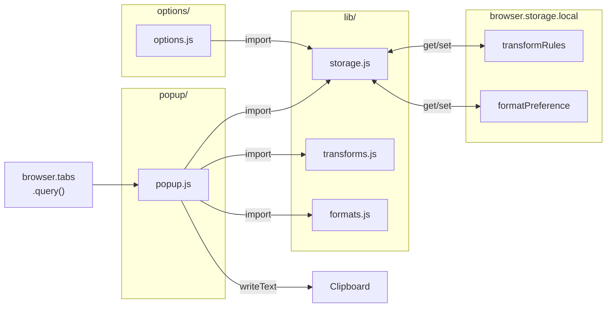
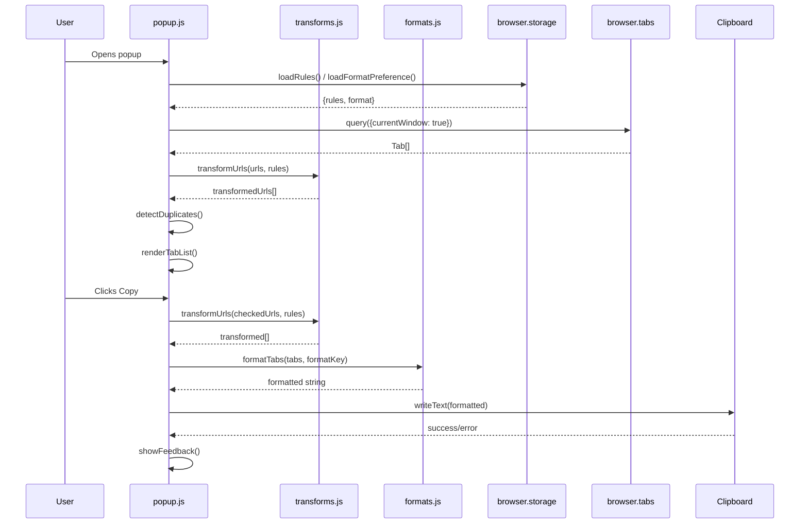

# Task: Tab Yeet v1 — Full Extension Build

* Task ID: tab-yeet-v1
* Complexity: Level 3
* Type: Feature (greenfield)

Implement the complete Tab Yeet browser extension for Firefox/LibreWolf (Manifest V2) as specified in `memory-bank/VISION.md`. The extension copies tab URLs from the current window to clipboard with regex-based URL transforms and configurable output formatting.

## Pinned Info

### Component Data Flow

How the extension's modules, browser APIs, and storage interact at runtime.

### Popup Sequence

The click-to-copy flow that is the extension's primary interaction.

## Component Analysis

### Affected Components

- **`manifest.json`** — New. Extension metadata: name, version, Manifest V2, permissions (`tabs`, `clipboardWrite`, `storage`), `browser_action` with popup, `options_ui`, icon references.
- **`lib/storage.js`** — New. Storage abstraction module. Exports `STORAGE_KEYS`, `DEFAULT_RULES`, and async helpers: `loadRules()`, `saveRules(rules)`, `loadFormatPreference()`, `saveFormatPreference(key)`. Contains first-run detection and default-seeding logic. Single source of truth for storage key names and default rules. *(Added during preflight — radical innovation finding.)*
- **`lib/transforms.js`** — New. Pure-function module. Exports `applyTransforms(url, rules)` and `transformUrls(urls, rules)`. No browser API dependency.
- **`lib/formats.js`** — New. Pure-function module. Exports a format map (`formatKey → fn(title, url)`) and a `formatTabs(tabs, formatKey)` function. v1 keys: `plain`, `markdown`. No browser API dependency.
- **`popup/popup.html`** — New. Popup markup: checkbox tab list, format dropdown, copy button, feedback area.
- **`popup/popup.js`** — New. Popup logic: tab querying, transform application, duplicate detection, rendering, format persistence, clipboard write, feedback display. Imports from `lib/`.
- **`popup/popup.css`** — New. Popup styling: compact popup layout, ellipsis truncation, feedback animation.
- **`options/options.html`** — New. Options page markup: rule list with add/edit/delete/reorder controls.
- **`options/options.js`** — New. Options logic: load/save rules from storage, CRUD operations, regex validation, default rule seeding on first run.
- **`options/options.css`** — New. Options page styling.
- **`icons/icon-48.png`, `icons/icon-96.png`** — New. Extension icons.

### Cross-Module Dependencies

- `popup/popup.js` → `lib/storage.js`: imports `loadRules()`, `loadFormatPreference()`, `saveFormatPreference()`
- `popup/popup.js` → `lib/transforms.js`: imports `transformUrls()`
- `popup/popup.js` → `lib/formats.js`: imports format map and `formatTabs()`
- `popup/popup.js` → `browser.tabs.query({currentWindow: true})`
- `popup/popup.js` → `navigator.clipboard.writeText()`
- `options/options.js` → `lib/storage.js`: imports `loadRules()`, `saveRules()`, `DEFAULT_RULES`
- `lib/storage.js` → `browser.storage.local` (all storage reads/writes centralized here)
- Shared storage schema enforced via `lib/storage.js` constants (keys: `transformRules`, `formatPreference`)

### Boundary Changes

N/A — greenfield build. All interfaces are new.

### Invariants & Constraints

1. Transform rules are applied in list order; all rules run against every URL (no short-circuit)
2. Duplicate detection happens AFTER transform application
3. Tab order in popup matches browser's left-to-right tab order (`index` property)
4. All tabs (including pinned) checked by default; duplicates unchecked
5. Format preference persists across sessions via `browser.storage.local`
6. Default transform rules ship on first install; if deleted, not restored on update
7. Manifest V2 only. Permissions: `tabs`, `clipboardWrite`, `storage`. No host permissions.
8. No `alert()` dialogs. Clipboard failures surface as visible error state in popup.

## Open Questions

None — implementation approach is clear. The VISION document prescribes the architecture, data schemas, UI behavior, and file structure with sufficient detail. No creative phase required.

Key decisions made during planning:
- **Module system**: ES modules (`import`/`export` with `<script type="module">`). Modern Firefox fully supports this in extension pages. Clean encapsulation and natively testable.
- **Test framework**: Vitest (native ESM support, fast, minimal config). Browser API mocks provided via shared test setup.
- **Clipboard strategy**: `navigator.clipboard.writeText()` primary, `document.execCommand('copy')` fallback, visible error state if both fail.

## Test Plan (TDD)

### Behaviors to Verify

**Transform Engine (`lib/transforms.js`):**
- Single matching rule transforms a URL correctly
- Multiple rules applied sequentially (output of rule N is input to rule N+1)
- Disabled rules (`enabled: false`) are skipped
- Non-matching rules leave URL unchanged
- Backreferences (`$1`, `$2`) work in replacement strings
- Invalid regex pattern is handled gracefully (skip rule, don't crash)
- Empty rule list returns URL unchanged
- Batch transform: array of URLs processed through all rules
- Default rules transform social media URLs correctly (Twitter/X, Instagram, Reddit, TikTok)

**Storage Module (`lib/storage.js`):**
- `loadRules()` returns rules from storage; seeds defaults on first run (empty storage)
- `loadRules()` returns default rules array when storage is empty
- `saveRules(rules)` persists rules to storage
- `loadFormatPreference()` returns saved format key, defaults to `"plain"` if unset
- `saveFormatPreference(key)` persists format preference
- `DEFAULT_RULES` contains exactly the 4 social media transforms from VISION
- `STORAGE_KEYS` exports the canonical key names

**Format System (`lib/formats.js`):**
- `plain` format: returns URL only
- `markdown` format: returns `- [title](url)`
- Multiple tabs joined by `\n`, no trailing newline
- Empty tab list returns empty string
- Format map contains exactly the expected keys (`plain`, `markdown`)
- `formatTabs()` applies the correct formatter per format key
- Unknown format key is handled gracefully

**Popup Logic (`popup/popup.js`):**
- Queries tabs from current window only (`{currentWindow: true}`)
- Renders all tabs as checkbox items, all checked by default
- Pinned tabs included and checked
- Tab display order matches `index` property
- Duplicate detection: tabs with same post-transform URL are unchecked (first occurrence stays checked)
- Format dropdown populated from format map keys
- Format preference loaded from `loadFormatPreference()` on popup open
- Format preference saved via `saveFormatPreference()` on dropdown change
- Copy: uses cached transformed URLs → formats → writes to clipboard
- Success feedback visible after copy
- Error state shown on clipboard failure
- Gear icon/link navigates to options page

**Options Page (`options/options.js`):**
- Loads and displays existing rules from storage
- Add: creates rule with pattern, replacement, `enabled: true`, unique id
- Edit: modifies pattern and/or replacement of existing rule
- Delete: removes rule from list and storage
- Reorder: move rule up/down in the list
- Toggle: flip `enabled` flag
- Regex validation: invalid pattern shows inline error message
- Regex validation: valid pattern clears error
- All mutations persist via `saveRules()` from `lib/storage.js`

### Test Infrastructure

- Framework: Vitest (new — to be installed)
- Test location: `test/` directory mirroring source structure
- Setup file: `test/setup.js` — provides `globalThis.browser` mock with `tabs.query`, `storage.local.get`, `storage.local.set` as `vi.fn()` stubs
- Environment: jsdom (for popup and options DOM tests)
- Conventions: `*.test.js` suffix, `describe`/`it` blocks
- New test files:
  - `test/lib/transforms.test.js`
  - `test/lib/formats.test.js`
  - `test/lib/storage.test.js`
  - `test/popup/popup.test.js`
  - `test/options/options.test.js`

### Integration Tests

- Rules changed in options page are read correctly by popup logic (shared storage key `transformRules`)
- Format preference set by popup persists and is re-read on subsequent popup open
- End-to-end copy flow: tabs → transform → deduplicate → format → clipboard content is correct

## Implementation Plan

### Step 1: Project Scaffolding

- Files: `package.json`, `vitest.config.js`, `test/setup.js`, `manifest.json`
- Changes:
  - `package.json`: name, version, `"type": "module"`, devDependencies (`vitest`), scripts (`test`, `test:watch`)
  - `vitest.config.js`: setup file reference, jsdom environment
  - `test/setup.js`: mock `globalThis.browser` (tabs, storage) and `navigator.clipboard`
  - `manifest.json`: Manifest V2 skeleton with permissions, `browser_action`, `options_ui`, icons

### Step 2: Transform Engine (TDD)

- Files: `lib/transforms.js`, `test/lib/transforms.test.js`
- TDD cycle:
  1. Stub `lib/transforms.js` with signatures + JSDoc: `applyTransforms(url, rules)`, `transformUrls(urls, rules)`
  2. Write all transform tests in `test/lib/transforms.test.js`
  3. Run tests → all fail
  4. Implement `applyTransforms()`: iterate rules, skip disabled, try/catch regex, apply `String.replace(new RegExp(pattern), replacement)`
  5. Implement `transformUrls()`: map over URLs calling `applyTransforms()`
  6. Run tests → all pass

### Step 3: Format System (TDD)

- Files: `lib/formats.js`, `test/lib/formats.test.js`
- TDD cycle:
  1. Stub `lib/formats.js` with signatures + JSDoc: `formats` map, `formatTabs(tabs, formatKey)`
  2. Write all format tests in `test/lib/formats.test.js`
  3. Run tests → all fail
  4. Implement format map: `plain` returns url, `markdown` returns `- [title](url)`
  5. Implement `formatTabs()`: map tabs through formatter, join with `\n`
  6. Run tests → all pass

### Step 4: Storage Module (TDD)

*(Added during preflight — radical innovation finding.)*

- Files: `lib/storage.js`, `test/lib/storage.test.js`
- TDD cycle:
  1. Stub `lib/storage.js` with signatures + JSDoc: `STORAGE_KEYS`, `DEFAULT_RULES`, `loadRules()`, `saveRules(rules)`, `loadFormatPreference()`, `saveFormatPreference(key)`
  2. Write storage tests in `test/lib/storage.test.js` (with mocked `browser.storage.local`)
  3. Run tests → all fail
  4. Implement: `loadRules()` reads from storage, seeds `DEFAULT_RULES` if empty; `saveRules()` writes to storage; format preference helpers with `"plain"` default
  5. Run tests → all pass

### Step 5: Popup (TDD)

- Files: `popup/popup.html`, `popup/popup.js`, `popup/popup.css`, `test/popup/popup.test.js`
- TDD cycle:
  1. Create `popup/popup.html` with markup structure (tab list container, format dropdown, copy button, feedback area, gear icon)
  2. Stub `popup/popup.js` with exported functions: `init()`, `loadTabs()`, `detectDuplicates(tabs, transformedUrls)`, `renderTabList(tabs, duplicateSet)`, `handleCopy()`, `showFeedback(success)`
  3. Create `popup/popup.css` with base styles
  4. Write popup tests (with mocked browser APIs and jsdom). Popup imports from `lib/storage.js`, `lib/transforms.js`, `lib/formats.js`.
  5. Run tests → all fail
  6. Implement popup logic
  7. Run tests → all pass

### Step 6: Options Page (TDD)

- Files: `options/options.html`, `options/options.js`, `options/options.css`, `test/options/options.test.js`
- TDD cycle:
  1. Create `options/options.html` with markup structure (rule list, add form, validation area)
  2. Stub `options/options.js` with exported functions: `init()`, `addRule(pattern, replacement)`, `editRule(id, updates)`, `deleteRule(id)`, `moveRule(id, direction)`, `toggleRule(id)`, `validateRegex(pattern)`, `renderRules(rules)`. Storage operations delegated to `lib/storage.js`.
  3. Create `options/options.css` with base styles
  4. Write options tests (with mocked browser APIs and jsdom)
  5. Run tests → all fail
  6. Implement options logic
  7. Run tests → all pass

### Step 7: Icons & Polish

- Files: `icons/icon-48.png`, `icons/icon-96.png`
- Changes:
  - Generate simple extension icons (48px and 96px)
  - Run full test suite
  - Update `memory-bank/systemPatterns.md` and `memory-bank/techContext.md` with patterns and tech discovered during implementation

### Step 8: Documentation

- Files: `README.md`
- Changes: Brief README covering what the extension does, how to install for development (`about:debugging` → Load Temporary Add-on), and how to run tests

## Technology Validation

- **Vitest**: New dev dependency. Validate: install, configure, run a trivial test to confirm ESM + jsdom works.
- **No runtime dependencies**: Extension is vanilla JS with ES modules. No bundler, no transpiler, no npm packages at runtime.

## Challenges & Mitigations

- **Browser API mocking in tests**: Popup and options tests need `browser.tabs`, `browser.storage`, `navigator.clipboard`. *Mitigation*: Shared `test/setup.js` provides minimal mocks using `vi.fn()`. Keep mock surface small; test pure logic separately from DOM glue.
- **Clipboard in hardened LibreWolf**: `navigator.clipboard.writeText()` may be restricted by privacy settings. *Mitigation*: Try/catch with fallback to `document.execCommand('copy')` via temporary textarea. Show error state if both fail, per VISION spec.
- **ES modules in Manifest V2 extension pages**: Supported in modern Firefox but less-tested path than classic `<script>` tags. *Mitigation*: Default CSP (`script-src 'self'`) allows ES module loading from extension package. Validate manually in Firefox during development.
- **DOM testing complexity**: Popup/options involve significant DOM interaction. *Mitigation*: Structure code to separate pure business logic (transforms, formats, duplicate detection) from DOM rendering. Test logic directly; test DOM integration via jsdom.

## Status

- [x] Component analysis complete
- [x] Open questions resolved (none identified)
- [x] Test planning complete (TDD)
- [x] Implementation plan complete
- [x] Technology validation identified
- [x] Preflight — PASS with plan amendment (added `lib/storage.js`)
- [ ] Build
- [ ] QA
